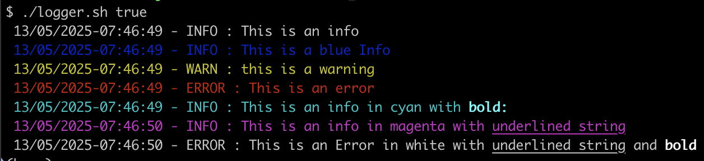

# Some shell tools to make life easier

## Logger

Print proper lines of log easily in your shell formatted with time, level, and different colors.

Example:




### How to use it ?

Load this file into your script with . ./logger.sh
Then use it instead of echo like this:

        logger info "Beginning of my application"

Argument 1: level among: debug, info, warn, error, success

An optionnaly a color, like this: ```info:white```` 

            
The possible colors are : blue, white, cyan, magenta, red, green, yellow

Argument 2: Text to print (where you can specify some part to be bold or underlined)

Examples: 
Add a word to be in bold: 
        
        "this word is #bold WordInBold #end_bold but not this one"
           
Add a word to be in underline: 

        "this word is #underline WordUnderlined #end_underline but not this one"


## Script Starter

**WARNING: Requires Bash version > 4.0**

Start easily a script with variables taken from command line, with default value, and a full helper.


### How to use it ?

Load this file into your script with . ./start_script.sh
Then use it in 3 steps:

1. Add a description to your script:
      
        add_desc "This is a global description of the script"

2. Add variables to your script with a default value and a description (Optional)
      
        add_var <VARIABLE_NAME> <OPTIONAL_DEFAULT_VALUE> <OPTIONAL_DESCRIPTION>
  
      
        add_var USER "root" "Name of the user"

3. Get all variables directly from command line and export them so they can be used in your script
      
        export_vars $@


## Execute to cluster

A simple script to execute a script file to all nodes of a cluster easily and very fast (in parallel).

### How to use it ?

This script executes script : `script.sh` (presents in the same folder) to all nodes of a cluster, which are provided by a `hosts` file (in one per line manner) or taken from local /etc/hosts file. 

Example:

1. Create file hosts with one host per line, example:

        ccycloud-1.inter.root.comops.site
        ccycloud-2.inter.root.comops.site
        ccycloud-3.inter.root.comops.site

2. Create a script to execute on each of the node, for example (default name is script.sh), for example: 

        mkdir -p /home/myuser/
        cat /etc/hosts | grep -v "localhost" > /home/myuser/hosts
        chmod 755 /home/myuser/hosts

3. Execute it with following command:

        ./execute_to_cluster.sh --hosts-file=hosts --script-name=script.sh

_Note: Provide a user (--node-user) and a password (--node-password) or ssh-key (--ssh-key) to connect to hosts if needed.
                                                                                                                         
It creates a named, according to first parameter or default to timestamped, directory for each execution.                 
If set, it archives results at the end, along with the script executed, and can print or not the result in real time.